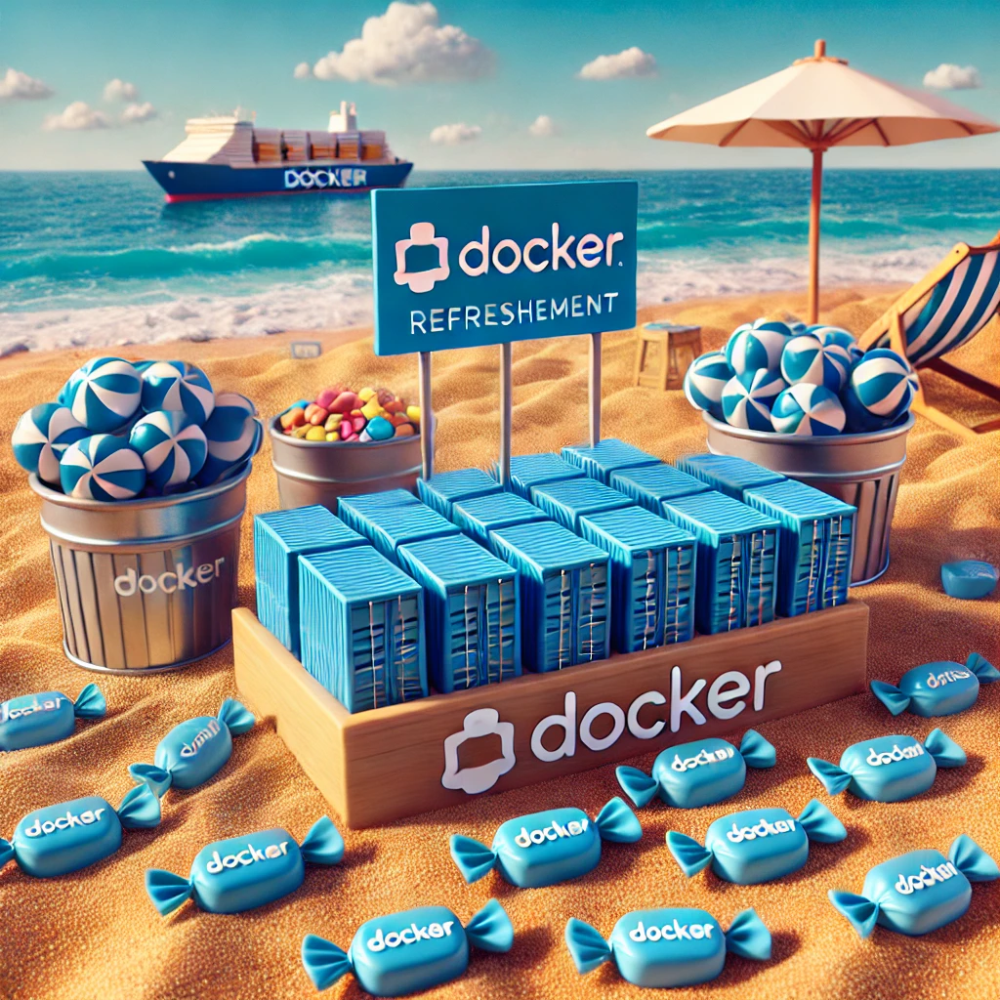

# docker_intro

The following repository is a refresher for docker containers it will contains the following small tasks:

## 1. Basic Web Server with Nginx
### Goal: Create a Dockerfile for a basic Nginx web server.
### Tasks:
* Build a Dockerfile that installs Nginx.
* Serve a static HTML page.
* Run the container and access the page from your browser.
* Push the image to Docker Hub.
## 2. Python Flask Application
### Goal: Build a simple Python Flask app in Docker.
### Tasks:
* Create a Dockerfile that installs Python and Flask.
* Build a Flask app with one route that returns a simple "Hello, World!".
* Use Docker Compose to manage the app and a separate Redis service for caching.
* Push the project to Docker Hub.
## 3. MySQL and Adminer Setup
### Goal: Set up a basic MySQL database with Adminer for management.
### Tasks:
* Use Docker Compose to create a network of two services: MySQL and Adminer.
* Ensure MySQL is accessible from Adminer.
* Set up environment variables for database credentials in Docker Compose.
* Access the database through Adminer.
## 4. Node.js App with MongoDB
### Goal: Set up a simple Node.js app with MongoDB as the database.
### Tasks:
* Write a Dockerfile for a Node.js app that connects to MongoDB.
* Use Docker Compose to orchestrate both the app and the MongoDB container.
* Test the connection between the app and MongoDB by adding/retrieving records.
## 5. WordPress with MySQL
### Goal: Set up a WordPress site using Docker Compose.
### Tasks:
* Use Docker Compose to spin up a WordPress container along with a MySQL database container.
* Use environment variables in Docker Compose to set WordPress and MySQL credentials.
* Access and configure the WordPress site from a browser.
## 6. Reverse Proxy with Nginx and Multiple Web Apps
### Goal: Use Nginx as a reverse proxy to manage multiple web applications.
### Tasks:
* Create Dockerfiles for two separate web applications (e.g., Python Flask or Node.js).
* Set up Nginx as a reverse proxy using Docker Compose.
* Ensure that Nginx routes traffic to the appropriate web apps based on the URL path.
## 7. Custom Docker Network Topology
### Goal: Create a custom network topology using Docker’s networking features.
### Tasks:
* Set up three containers in a custom network: one database, one web server, and one application server.
* Ensure the app server connects to the web server and the database on the same custom network.
* Test the connectivity using simple network tools (e.g., ping, curl).
## 8. Continuous Integration with Jenkins
### Goal: Run a Jenkins server in Docker to automate builds.
### Tasks:
* Write a Dockerfile to install and run Jenkins.
* Use Docker Compose to manage Jenkins.
* Create a simple job in Jenkins that pulls code from GitHub and builds a Docker image.
* Push the built image to Docker Hub from within Jenkins.
## 9. Microservices with Docker Compose
### Goal: Build a microservices architecture using Docker Compose.
### Tasks:
* Create three Dockerfiles for services (e.g., user service, product service, and an API gateway).
* Use Docker Compose to define and manage all three services.
* Ensure the services can communicate with each other over the network.
## 10. Push to Docker Hub
### Goal: Automate image building and pushing to Docker Hub.
### Tasks:
* Create a script that builds Docker images for one of the previous projects.
* Tag the image with the appropriate version.
* Push the image to Docker Hub using the script.